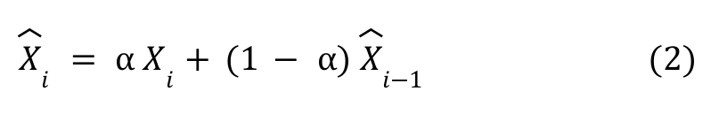
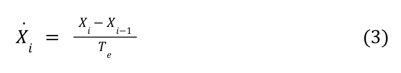
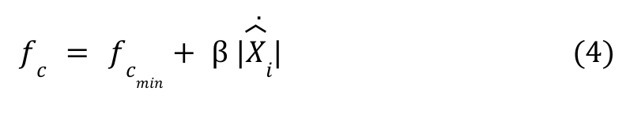
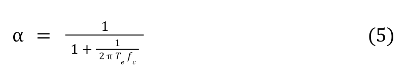
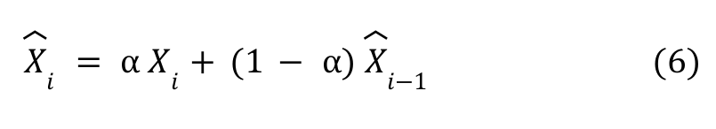

# Time series filtering

Here we consider the following filtering algorithms:
* Moving Average filter
* Exponential Moving Average filter
* One Euro filter  

This repository contains code for this medium blog-post ([link](http://)).

#### Moving Average filter

#### Exponential Moving Average filter

#### One Euro filter

#### Data and filters visualization
